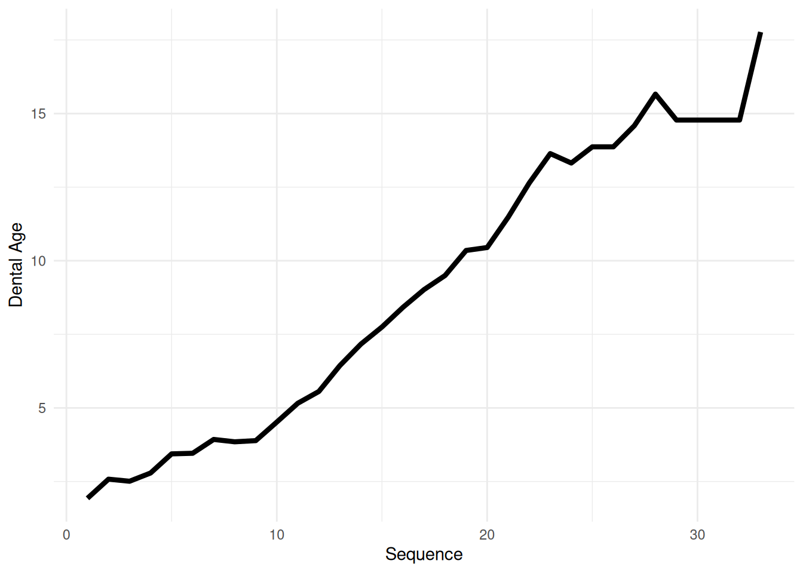
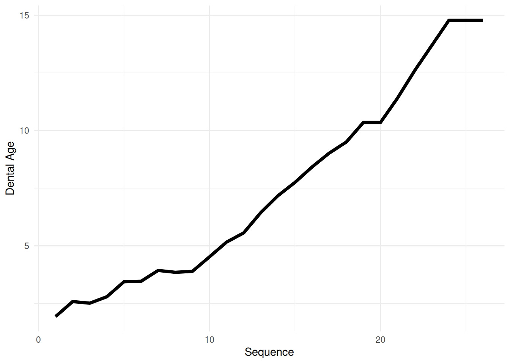
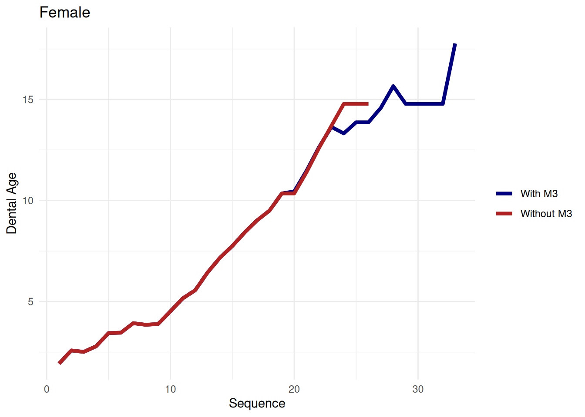
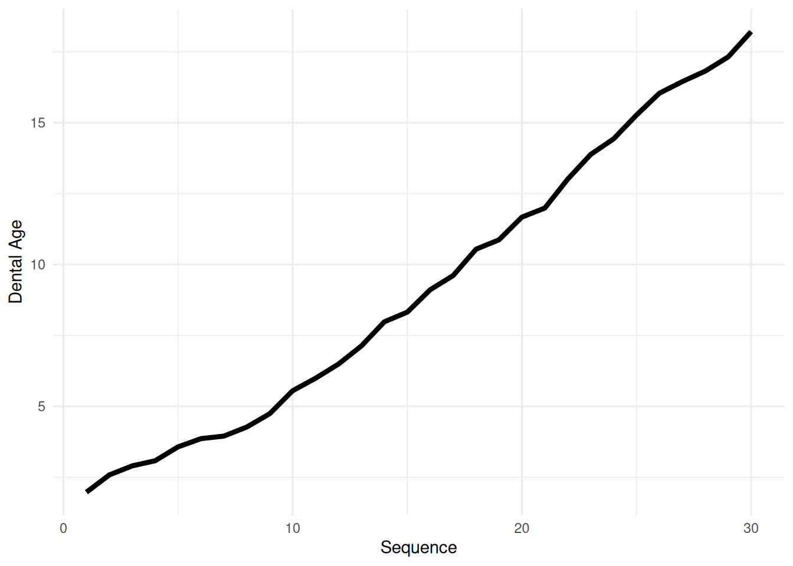
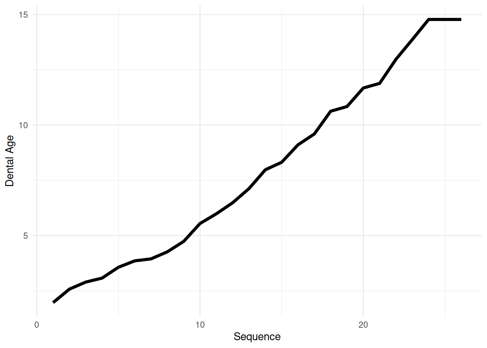
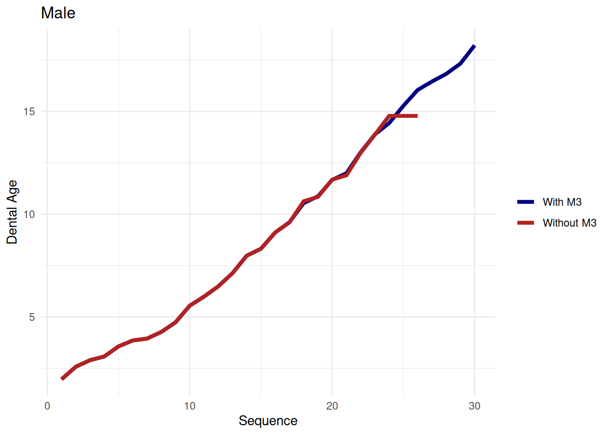
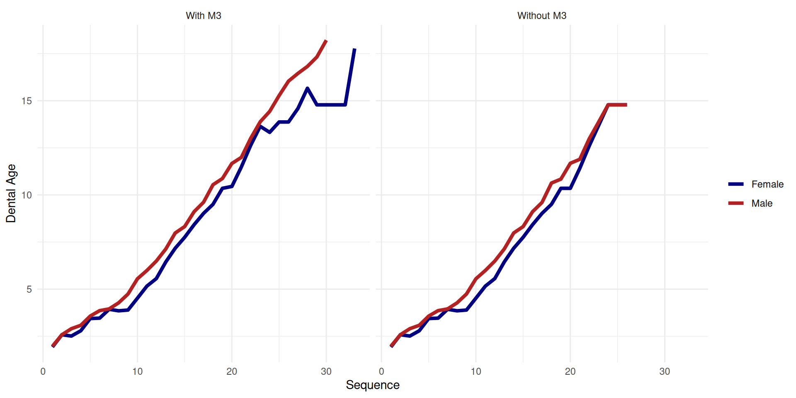

# Dental Age Continuity

``` r

library(AgeFromDentition)
library(dplyr)
library(tibble)
library(ggplot2)
library(gt)
library(tidyr)
```

Dental age estimates generally increase as tooth stages advance. This
vignette constructs fine-scale example progressions for females and
males, starting with only the canine scored and gradually adding teeth,
ending with all teeth at `A.c` except M3 at `A.5`.

## Female progression with M3

``` r

female <- tribble(
    ~Sex , ~Canine , ~P3     , ~P4     , ~M1    , ~M2     , ~M3     ,
    "F"  , "C.oc"  , NA      , NA      , NA     , NA      , NA      ,
    "F"  , "Cr.5"  , NA      , NA      , NA     , NA      , NA      ,
    "F"  , "Cr.5"  , "C.i"   , NA      , NA     , NA      , NA      ,
    "F"  , "Cr.5"  , "C.co"  , NA      , NA     , NA      , NA      ,
    "F"  , "Cr.75" , "C.oc"  , NA      , NA     , NA      , NA      ,
    "F"  , "Cr.75" , "C.oc"  , NA      , "R.i"  , NA      , NA      ,
    "F"  , "Cr.75" , "Cr.5"  , NA      , "Cl.i" , NA      , NA      ,
    "F"  , "Cr.75" , "Cr.5"  , NA      , "Cl.i" , "C.i"   , NA      ,
    "F"  , "Cr.75" , "Cr.5"  , "C.i"   , "R.25" , "C.i"   , NA      ,
    "F"  , "Cr.c"  , "Cr.75" , "C.co"  , "R.25" , "C.co"  , NA      ,
    "F"  , "Cr.c"  , "Cr.c"  , "C.oc"  , "R.5"  , "C.oc"  , NA      ,
    "F"  , "Cr.c"  , "Cr.c"  , "Cr.5"  , "R.5"  , "Cr.5"  , NA      ,
    "F"  , "R.i"   , "Cr.c"  , "Cr.75" , "R.75" , "Cr.75" , NA      ,
    "F"  , "R.i"   , "R.i"   , "Cr.c"  , "R.75" , "Cr.c"  , NA      ,
    "F"  , "R.25"  , "R.i"   , "R.i"   , "R.75" , "R.i"   , NA      ,
    "F"  , "R.25"  , "R.25"  , "R.i"   , "R.c"  , "Cl.i"  , NA      ,
    "F"  , "R.5"   , "R.25"  , "R.25"  , "R.c"  , "R.25"  , NA      ,
    "F"  , "R.5"   , "R.5"   , "R.25"  , "A.5"  , "R.25"  , NA      ,
    "F"  , "R.75"  , "R.5"   , "R.5"   , "A.c"  , "R.5"   , NA      ,
    "F"  , "R.75"  , "R.5"   , "R.5"   , "A.c"  , "R.5"   , "C.oc"  ,
    "F"  , "R.c"   , "R.75"  , "R.75"  , "A.c"  , "R.75"  , "Cr.5"  ,
    "F"  , "A.5"   , "R.c"   , "R.c"   , "A.c"  , "R.c"   , "Cr.75" ,
    "F"  , "A.c"   , "A.5"   , "A.5"   , "A.c"  , "A.5"   , "Cr.c"  ,
    "F"  , "A.c"   , "A.c"   , "A.c"   , "A.c"  , "A.c"   , "Cr.c"  ,
    "F"  , "A.c"   , "A.c"   , "A.c"   , "A.c"  , "A.c"   , "R.i"   ,
    "F"  , "A.c"   , "A.c"   , "A.c"   , "A.c"  , "A.c"   , "R.i"   ,
    "F"  , "A.c"   , "A.c"   , "A.c"   , "A.c"  , "A.c"   , "Cl.i"  ,
    "F"  , "A.c"   , "A.c"   , "A.c"   , "A.c"  , "A.c"   , "R.25"  ,
    "F"  , "A.c"   , "A.c"   , "A.c"   , "A.c"  , "A.c"   , "R.5"   ,
    "F"  , "A.c"   , "A.c"   , "A.c"   , "A.c"  , "A.c"   , "R.75"  ,
    "F"  , "A.c"   , "A.c"   , "A.c"   , "A.c"  , "A.c"   , "R.c"   ,
    "F"  , "A.c"   , "A.c"   , "A.c"   , "A.c"  , "A.c"   , "A.5"   ,
    "F"  , "A.c"   , "A.c"   , "A.c"   , "A.c"  , "A.c"   , "A.c"   ,
)
```

``` r

female_results <- purrr::map_dfr(seq_len(nrow(female)), \(i) {
    est <- estimate_dental_age(female[i, ], verbose = FALSE)
    info <- ac_info(est)
    tibble(
        row = i,
        dental_age = est[["dental_age"]],
        ci_lower = est[["ci_lower"]],
        ci_upper = est[["ci_upper"]],
        n_estimable = info$n_estimable,
        compatibility = info$compatibility
    )
})

Females <- female |>
    mutate(row = row_number()) |>
    left_join(female_results, by = "row") |>
    select(-Sex, -row) |>
    mutate(across(c(dental_age, ci_lower, ci_upper), \(x) round(x, 2))) |>
    mutate(row = row_number()) |>
    relocate(row)
```

``` r

Females |>
    gt() |>
    sub_missing() |>
    cols_label(
        row = "Sequence",
        dental_age = "Age",
        ci_lower = "Lower",
        ci_upper = "Upper",
        n_estimable = "n",
        compatibility = "Compat."
    ) |>
    tab_spanner(label = "Scores", columns = Canine:M3) |>
    tab_spanner(label = "95% CI", columns = c(ci_lower, ci_upper))
```

[TABLE]

``` r

Females |>
    drop_na(dental_age) |>
    ggplot(aes(x = row, y = dental_age)) +
    geom_line(linewidth = 1.5) +
    labs(x = "Sequence", y = "Dental Age") +
    theme_minimal()
```



## Female progression without M3

The same progression, but M3 is never scored. Without M3, once all five
remaining teeth have reached A_(c) (row 24 onward), the estimate is
derived from the M2 A_(c) attainment distribution rather than the
age-given-stage model.

``` r

female_no_m3 <- female |>
    mutate(M3 = NA) |>
    slice(1:26)
```

``` r

female_no_m3_results <- purrr::map_dfr(
    seq_len(nrow(female_no_m3)),
    \(i) {
        est <- estimate_dental_age(
            female_no_m3[i, ],
            verbose = FALSE
        )
        info <- ac_info(est)
        tibble(
            row = i,
            dental_age = est[["dental_age"]],
            ci_lower = est[["ci_lower"]],
            ci_upper = est[["ci_upper"]],
            n_estimable = info$n_estimable,
            compatibility = info$compatibility
        )
    }
)

Females_no_M3 <- female_no_m3 |>
    mutate(row = row_number()) |>
    left_join(female_no_m3_results, by = "row") |>
    select(-Sex, -row) |>
    mutate(across(
        c(dental_age, ci_lower, ci_upper),
        \(x) round(x, 2)
    )) |>
    mutate(row = row_number()) |>
    relocate(row)
```

``` r

Females_no_M3 |>
    gt() |>
    sub_missing() |>
    cols_label(
        row = "Sequence",
        dental_age = "Age",
        ci_lower = "Lower",
        ci_upper = "Upper",
        n_estimable = "n",
        compatibility = "Compat."
    ) |>
    tab_spanner(label = "Scores", columns = Canine:M3) |>
    tab_spanner(
        label = "95% CI",
        columns = c(ci_lower, ci_upper)
    )
```

[TABLE]

``` r

Females_no_M3 |>
    drop_na(dental_age) |>
    ggplot(aes(x = row, y = dental_age)) +
    geom_line(linewidth = 1.5) +
    labs(x = "Sequence", y = "Dental Age") +
    theme_minimal()
```



### Comparison: with and without M3



## Male progression with M3

``` r

male <- tribble(
    ~Sex , ~Canine , ~P3     , ~P4     , ~M1    , ~M2     , ~M3     ,
    "M"  , "C.oc"  , NA      , NA      , NA     , NA      , NA      ,
    "M"  , "Cr.5"  , "C.i"   , NA      , NA     , NA      , NA      ,
    "M"  , "Cr.5"  , "C.co"  , NA      , NA     , NA      , NA      ,
    "M"  , "Cr.5"  , "C.oc"  , NA      , "Cr.c" , NA      , NA      ,
    "M"  , "Cr.75" , "C.oc"  , NA      , "R.i"  , NA      , NA      ,
    "M"  , "Cr.75" , "Cr.5"  , NA      , "R.i"  , "C.i"   , NA      ,
    "M"  , "Cr.75" , "Cr.5"  , "C.i"   , "Cl.i" , "C.i"   , NA      ,
    "M"  , "Cr.75" , "Cr.5"  , "C.co"  , "R.25" , "C.co"  , NA      ,
    "M"  , "Cr.75" , "Cr.75" , "C.oc"  , "R.25" , "C.oc"  , NA      ,
    "M"  , "Cr.c"  , "Cr.75" , "Cr.5"  , "R.5"  , "Cr.5"  , NA      ,
    "M"  , "Cr.c"  , "Cr.c"  , "Cr.5"  , "R.75" , "Cr.5"  , NA      ,
    "M"  , "Cr.c"  , "Cr.c"  , "Cr.75" , "R.75" , "Cr.75" , NA      ,
    "M"  , "R.i"   , "Cr.c"  , "Cr.c"  , "R.75" , "Cr.c"  , NA      ,
    "M"  , "R.i"   , "R.i"   , "R.i"   , "R.c"  , "R.i"   , NA      ,
    "M"  , "R.25"  , "R.i"   , "R.i"   , "R.c"  , "Cl.i"  , NA      ,
    "M"  , "R.25"  , "R.25"  , "R.25"  , "R.c"  , "R.25"  , NA      ,
    "M"  , "R.5"   , "R.25"  , "R.25"  , "A.5"  , "R.25"  , "C.i"   ,
    "M"  , "R.5"   , "R.5"   , "R.5"   , "A.c"  , "R.5"   , "C.co"  ,
    "M"  , "R.75"  , "R.5"   , "R.5"   , "A.c"  , "R.5"   , "C.oc"  ,
    "M"  , "R.75"  , "R.75"  , "R.75"  , "A.c"  , "R.75"  , "Cr.5"  ,
    "M"  , "R.c"   , "R.75"  , "R.75"  , "A.c"  , "R.75"  , "Cr.75" ,
    "M"  , "A.5"   , "R.c"   , "R.c"   , "A.c"  , "R.c"   , "Cr.c"  ,
    "M"  , "A.c"   , "A.5"   , "A.5"   , "A.c"  , "A.5"   , "R.i"   ,
    "M"  , "A.c"   , "A.c"   , "A.c"   , "A.c"  , "A.c"   , "Cl.i"  ,
    "M"  , "A.c"   , "A.c"   , "A.c"   , "A.c"  , "A.c"   , "R.25"  ,
    "M"  , "A.c"   , "A.c"   , "A.c"   , "A.c"  , "A.c"   , "R.5"   ,
    "M"  , "A.c"   , "A.c"   , "A.c"   , "A.c"  , "A.c"   , "R.75"  ,
    "M"  , "A.c"   , "A.c"   , "A.c"   , "A.c"  , "A.c"   , "R.c"   ,
    "M"  , "A.c"   , "A.c"   , "A.c"   , "A.c"  , "A.c"   , "A.5"   ,
    "M"  , "A.c"   , "A.c"   , "A.c"   , "A.c"  , "A.c"   , "A.c"   ,
)
```

``` r

male_results <- purrr::map_dfr(seq_len(nrow(male)), \(i) {
    est <- estimate_dental_age(male[i, ], verbose = FALSE)
    info <- ac_info(est)
    tibble(
        row = i,
        dental_age = est[["dental_age"]],
        ci_lower = est[["ci_lower"]],
        ci_upper = est[["ci_upper"]],
        n_estimable = info$n_estimable,
        compatibility = info$compatibility
    )
})

Males <- male |>
    mutate(row = row_number()) |>
    left_join(male_results, by = "row") |>
    select(-Sex, -row) |>
    mutate(across(c(dental_age, ci_lower, ci_upper), \(x) round(x, 2))) |>
    mutate(row = row_number()) |>
    relocate(row)
```

``` r

Males |>
    gt() |>
    sub_missing() |>
    cols_label(
        row = "Sequence",
        dental_age = "Age",
        ci_lower = "Lower",
        ci_upper = "Upper",
        n_estimable = "n",
        compatibility = "Compat."
    ) |>
    tab_spanner(label = "Scores", columns = Canine:M3) |>
    tab_spanner(label = "95% CI", columns = c(ci_lower, ci_upper))
```

[TABLE]

``` r

Males |>
    drop_na(dental_age) |>
    ggplot(aes(x = row, y = dental_age)) +
    geom_line(linewidth = 1.5) +
    labs(x = "Sequence", y = "Dental Age") +
    theme_minimal()
```



## Male progression without M3

``` r

male_no_m3 <- male |>
    mutate(M3 = NA) |>
    slice(1:26)
```

``` r

male_no_m3_results <- purrr::map_dfr(
    seq_len(nrow(male_no_m3)),
    \(i) {
        est <- estimate_dental_age(
            male_no_m3[i, ],
            verbose = FALSE
        )
        info <- ac_info(est)
        tibble(
            row = i,
            dental_age = est[["dental_age"]],
            ci_lower = est[["ci_lower"]],
            ci_upper = est[["ci_upper"]],
            n_estimable = info$n_estimable,
            compatibility = info$compatibility
        )
    }
)

Males_no_M3 <- male_no_m3 |>
    mutate(row = row_number()) |>
    left_join(male_no_m3_results, by = "row") |>
    select(-Sex, -row) |>
    mutate(across(
        c(dental_age, ci_lower, ci_upper),
        \(x) round(x, 2)
    )) |>
    mutate(row = row_number()) |>
    relocate(row)
```

``` r

Males_no_M3 |>
    gt() |>
    sub_missing() |>
    cols_label(
        row = "Sequence",
        dental_age = "Age",
        ci_lower = "Lower",
        ci_upper = "Upper",
        n_estimable = "n",
        compatibility = "Compat."
    ) |>
    tab_spanner(label = "Scores", columns = Canine:M3) |>
    tab_spanner(
        label = "95% CI",
        columns = c(ci_lower, ci_upper)
    )
```

[TABLE]

``` r

Males_no_M3 |>
    drop_na(dental_age) |>
    ggplot(aes(x = row, y = dental_age)) +
    geom_line(linewidth = 1.5) +
    labs(x = "Sequence", y = "Dental Age") +
    theme_minimal()
```



### Comparison: with and without M3



## Sex comparison



## Notes

- For females, rows 1–2 use only the canine; for males, only row 1 (P3
  is introduced at row 2 for males). With a single tooth, the estimate
  tracks that tooth’s reference age directly.
- Both sexes introduce additional teeth in the same order (P3, then M1,
  M2, P4), but at different rows because of sex differences in
  developmental timing:
  - **Female:** P3 at row 3 (`C.i`), M1 at row 6 (`R.i` — already
    starting root formation), M2 at row 8 (`C.i`), P4 at row 9 (`C.i`).
  - **Male:** P3 at row 2 (`C.i`), M1 at row 4 (`Cr.c` — crown just
    complete, reflecting M1’s early development), M2 at row 6 (`C.i`),
    P4 at row 7 (`C.i`).
- The male progression uses stages that lag behind the female for the
  canine (~1 stage) and P3 (~1 stage), because males develop these teeth
  later. M1 and P4 are minimally offset.
- For females, M3 first appears at row 20 (`C.oc`); for males, at row 17
  (`C.i`) — three rows earlier and at an earlier crown stage, reflecting
  slightly earlier M3 development in males.
- For females, late M3 stages (`R.5` through `A.5`) have no published
  log-normal parameters and are excluded from the age estimate. For
  males, all M3 stages have parameters.
- M1 reaches `A.c` at row 19 for females and row 18 for males. The
  `compatibility` column shows whether the age estimate and completion
  threshold agree.
- Once all five non-M3 teeth have reached `A.c` (row 24 for both sexes),
  the estimate switches from the age-given-stage model to the M2 A_(c)
  attainment distribution and remains fixed — all subsequent rows
  without M3 are identical. The without-M3 progressions are shown
  through row 26 only; rows 27 onward are omitted as redundant. For
  females with M3 scored, the switch is delayed: M3 remains estimable
  through row 28; the M2 A_(c) estimate takes over at row 29 when M3
  enters its unparameterized stages (`R.5` through `A.5`). For males
  with M3, M3 is estimable through the final row and the switch never
  occurs.
- Small dips in dental age occur when a new tooth is added at an early
  stage (e.g., M3 at `C.i`) or when several teeth transition to `A.c` at
  once.
